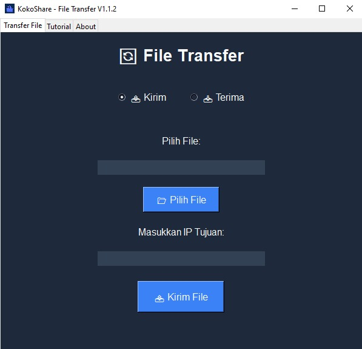
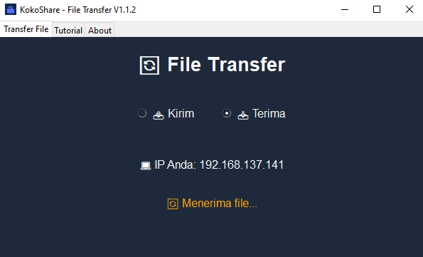

# KokoShare File Transfer For Windows
KokoShare File Transfer adalah aplikasi transfer file untuk Windows yang memungkinkan pengguna mengirim dan menerima file melalui jaringan nirkabel antar perangkat dengan mudah.

## Fitur Utama
- **Kirim dan Terima File**: Pilih file yang ingin dikirim dan masukkan alamat IP tujuan untuk memulai transfer.
- **User Interface**: Tampilan antarmuka pengguna yang sederhana dan mudah digunakan dengan tab navigasi untuk pengaturan.
- **Berbasis Jaringan**: Mendukung pengiriman file melalui jaringan lokal dengan menggunakan TCP/IP.

## Cara Menggunakan
1. **Mode Kirim**: Pilih file yang akan dikirim dan masukkan IP tujuan, lalu klik "Kirim File".
2. **Mode Terima**: Jalankan aplikasi ini di perangkat penerima dan file akan otomatis diterima.

## Screenshot

## Instalasi
1. Unduh dan ekstrak file dari [link ini](#).
2. Jalankan aplikasi `kokoshare_filetransfer.exe` untuk memulai.
3. Pilih mode pengiriman atau penerimaan file dan ikuti instruksi di layar.

## Pengembang
Aplikasi ini dikembangkan oleh [Rizko Imsar](https://github.com/rizko77) dengan tujuan untuk mempermudah pengiriman file antar perangkat.

## Lisensi
Aplikasi ini bersifat **open-source** dan dirilis di bawah [Lisensi MIT](#).
